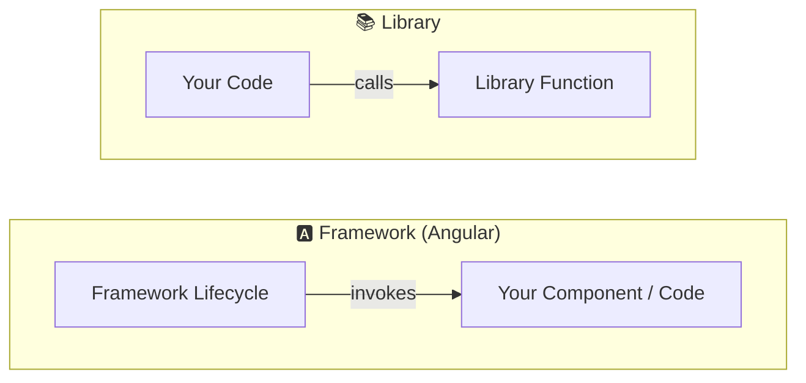
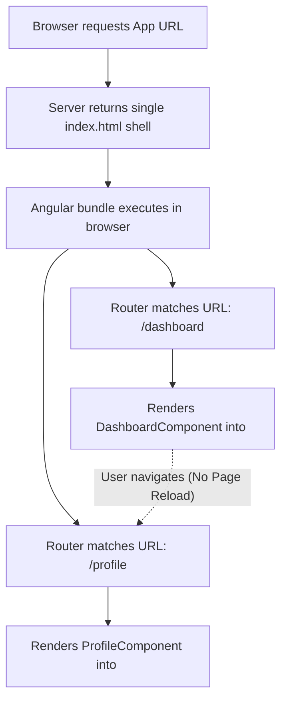
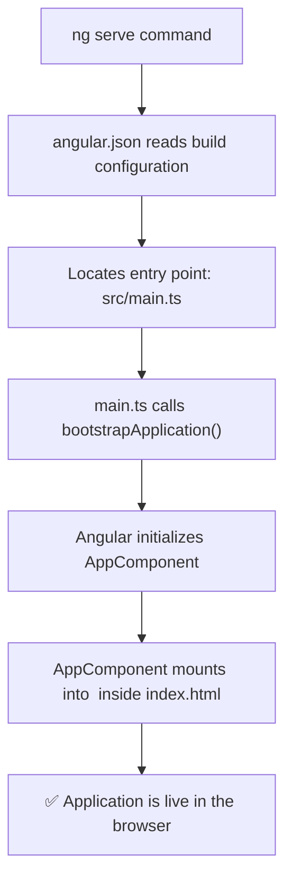

# 📘 01. Angular — Introduction & Application Boot Flow

> **Topics:** What is Angular · Framework vs Library · Single Page Applications (SPA) · Angular CLI Basics · Component Architecture (Standalone vs NgModule) · Application Boot Flow (`ng serve`)  
> **Source:** Strictly verified against official Angular documentation ([angular.dev](https://angular.dev)).

---

## 1. What is Angular?

> **Angular** is a web development framework for building single-page applications (SPAs) using TypeScript and modern web standards.

Angular is a **fully-featured platform** that provides built-in, out-of-the-box solutions for:
- Component-based UI architecture
- Declarative templates with data binding
- Built-in routing and navigation
- Dependency Injection (DI) system
- Form handling and validation
- HTTP client for backend communication
- CLI-driven project management and optimization tooling

---

## 2. Framework vs. Library

The core technical distinction between a framework and a library is **Inversion of Control (IoC)** — specifically, *who calls whom*.

- **Framework (e.g., Angular):** The framework **calls your code**. You structure your application according to the framework's conventions, and the framework controls the execution lifecycle.
- **Library (e.g., Lodash, RxJS):** Your code **calls the library**. You remain in control of the application architecture and invoke library functions when needed.



### Comparison Summary

| Feature | Framework (Angular) | Library |
| :--- | :--- | :--- |
| **Control Flow** | Framework controls execution (Inversion of Control) | Your code explicitly calls library functions |
| **Architecture** | Enforces consistent structure & conventions | Unopinionated; structure is decided by developer |
| **Tooling & Ecosystem** | Integrated CLI, Router, Forms, DI, HTTP Client | Focused on specific tasks; requires combining third-party tools |

---

## 3. Single Page Application (SPA)

> A **Single Page Application (SPA)** is a web application that loads a single HTML page (`index.html`) at startup and dynamically updates content without reloading the full page when users navigate.



### How SPAs Work in Angular
1. The browser requests the app and receives **`index.html`** along with JavaScript bundles generated by Angular.
2. The `index.html` file contains a host element (by default `<app-root></app-root>`).
3. Angular initializes and mounts the root component inside `<app-root>`.
4. As users click links, the Angular Router updates the browser DOM without requesting new HTML pages from the server.

---

## 4. Angular CLI Basics

The **Angular CLI** is the official command-line interface for creating, building, running, and maintaining Angular applications.

### Essential CLI Commands

```bash
# 1. Install Angular CLI globally
npm install -g @angular/cli

# 2. Create a new Angular application
ng new my-angular-app

# 3. Serve the application locally (http://localhost:4200)
ng serve

# Serve and open automatically in browser
ng serve --open   # or: ng serve -o

# 4. Generate building blocks
ng generate component components/user-profile   # short: ng g c components/user-profile
ng generate service services/user               # short: ng g s services/user
ng generate pipe pipes/custom-format            # short: ng g p pipes/custom-format
ng generate directive directives/highlight      # short: ng g d directives/highlight

# 5. Build for production (outputs optimized static files to dist/)
ng build
```

---

## 5. Component Architecture: Standalone vs. NgModule

Angular applications are built as a tree of **Components**.

### Modern Angular: Standalone Components (Default in v17+)
Starting with Angular 17/18/19+, **Standalone Components** are the standard, default way to build Angular applications. Standalone components directly manage their own dependencies without requiring an `NgModule`.

```ts
import { Component } from '@angular/core';
import { CommonModule } from '@angular/common';

@Component({
  selector: 'app-user',
  standalone: true, // Default in modern Angular
  imports: [CommonModule],
  template: `<h1>Hello, {{ username }}</h1>`,
  styles: [`h1 { color: #1976d2; }`]
})
export class UserComponent {
  username = 'Angular Developer';
}
```

### Traditional Angular: NgModule Architecture
In legacy or modular codebases, components are grouped into **Modules** (`@NgModule`):

```ts
import { NgModule } from '@angular/core';
import { BrowserModule } from '@angular/platform-browser';
import { AppComponent } from './app.component';

@NgModule({
  declarations: [AppComponent], // Components declared in this module
  imports: [BrowserModule],     // External modules imported
  providers: [],                // Services provided
  bootstrap: [AppComponent]     // Root component to start
})
export class AppModule {}
```

| Aspect | Modern Standalone Architecture | NgModule Architecture |
| :--- | :--- | :--- |
| **Default in** | Angular v17+ | Angular v2 to v16 |
| **Dependency Management** | Explicit via `@Component({ imports: [...] })` | Centralized via `@NgModule({ imports: [...], declarations: [...] })` |
| **Setup Complexity** | Low (less boilerplate) | High (requires understanding modules) |

---

## 6. Application Boot Flow (`ng serve`)

Understanding what happens behind the scenes when you execute `ng serve` is essential for mastering Angular.



### Detailed Boot Steps

#### Step 1: `angular.json`
`angular.json` is the configuration file for the Angular workspace. It defines project entry points, asset locations, and build settings:
```json
"architect": {
  "build": {
    "builder": "@angular-devkit/build-angular:application",
    "options": {
      "outputPath": "dist/my-app",
      "index": "src/index.html",
      "browser": "src/main.ts"
    }
  }
}
```

#### Step 2: `src/main.ts` (Entry Point)
`main.ts` is the first TypeScript file executed by the browser.

- **Standalone Boot Flow (Modern Standard):**
```ts
import { bootstrapApplication } from '@angular/platform-browser';
import { AppComponent } from './app/app.component';
import { appConfig } from './app/app.config';

bootstrapApplication(AppComponent, appConfig)
  .catch((err) => console.error(err));
```

- **NgModule Boot Flow (Traditional):**
```ts
import { platformBrowserDynamic } from '@angular/platform-browser-dynamic';
import { AppModule } from './app/app.module';

platformBrowserDynamic().bootstrapModule(AppModule)
  .catch((err) => console.error(err));
```

#### Step 3: Root Component (`AppComponent`)
Angular reads `@Component({ selector: 'app-root' })` on `AppComponent` and instantiates the component class and template.

#### Step 4: Rendering in `src/index.html`
Angular locates the `<app-root></app-root>` tag inside `index.html` and replaces its internal DOM with the rendered template of `AppComponent`:

```html
<!DOCTYPE html>
<html lang="en">
<head>
  <meta charset="utf-8" />
  <title>My Angular App</title>
  <base href="/" />
  <meta name="viewport" content="width=device-width, initial-scale=1" />
</head>
<body>
  <!-- Angular injects the root component here -->
  <app-root></app-root>
</body>
</html>
```

---

## 📚 Official References
- [angular.dev — What is Angular?](https://angular.dev/overview)
- [angular.dev — Standalone Components](https://angular.dev/guide/components/importing)
- [angular.dev — Angular CLI Overview](https://angular.dev/tools/cli)
