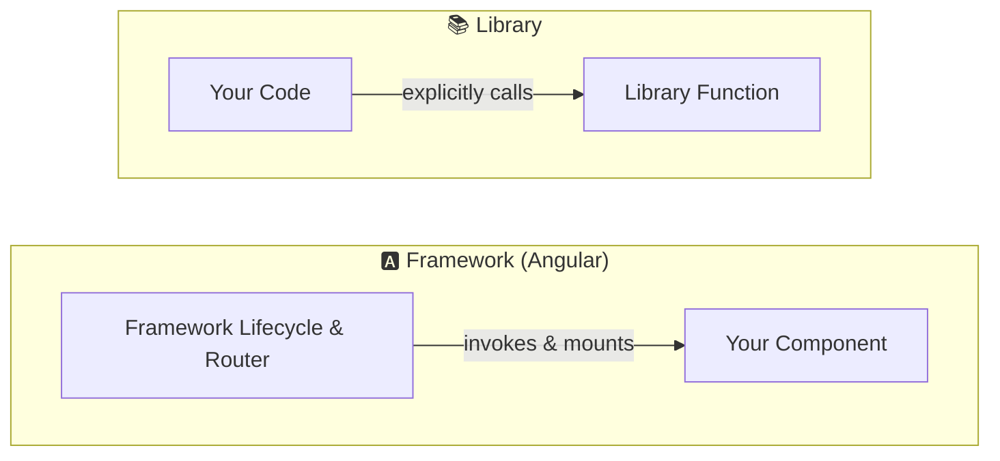
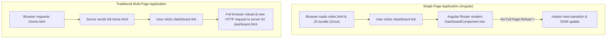
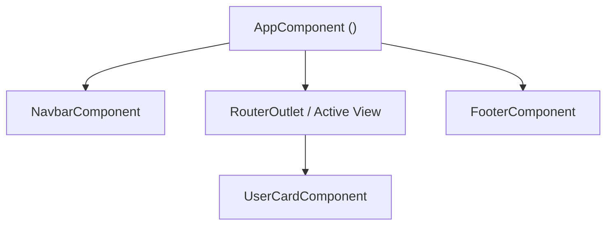
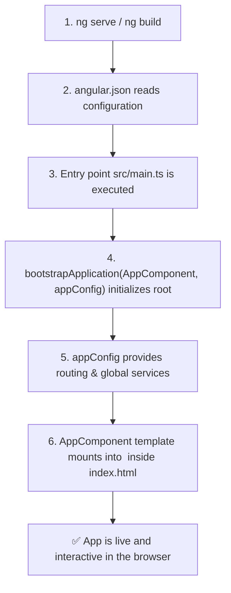

# 📘 01. Angular — Introduction & Application Boot Flow

> **Topics:** What is Angular · Framework vs Library (Inversion of Control) · Single Page Applications (SPA) · Angular CLI Basics · Component Architecture (Standalone vs NgModule) · Application Boot Flow (`ng serve`)  
> **Source:** Strictly verified against official Angular documentation ([angular.dev](https://angular.dev)).

---

## 1. What is Angular?

> **Angular** is a modern, TypeScript-based web development framework designed for building scalable, high-performance Single Page Applications (SPAs).

Angular is a **complete platform** providing built-in solutions out of the box:
- **Component-Based UI**: Encapsulated, reusable user interface building blocks.
- **Declarative Templates & Data Binding**: Synchronize component logic with the DOM seamlessly.
- **Modern Reactivity (Signals)**: Fine-grained, high-performance state tracking.
- **Robust Routing**: Built-in client-side routing with lazy loading and guards.
- **Dependency Injection (DI)**: First-class modular design and testability.
- **Forms & Validation**: Reactive and template-driven forms.
- **HTTP Client**: Typed backend communication with interceptors.
- **Angular CLI**: Code generation, local development server, testing, and optimized production builds.

---

## 2. Framework vs. Library

The fundamental difference between a framework and a library is **Inversion of Control (IoC)** — *who is calling whom*.

- **Framework (e.g., Angular):** The framework **calls your code**. You register components, directives, and lifecycle hooks; the framework controls execution, change detection, and rendering.
- **Library (e.g., Lodash, RxJS utility):** Your code **calls the library**. You decide when and where to invoke utility functions.



### Code Example Comparison

```ts
// --- LIBRARY USAGE (You call the code) ---
import { capitalize } from 'lodash';
const result = capitalize('angular'); // You explicitly control when this executes

// --- FRAMEWORK USAGE (Angular calls your code) ---
import { Component, OnInit } from '@angular/core';

@Component({
  selector: 'app-welcome',
  template: `<h1>Hello, Angular!</h1>`
})
export class WelcomeComponent implements OnInit {
  ngOnInit(): void {
    // Angular automatically calls this lifecycle hook when the component is initialized
    console.log('Component initialized by Angular framework lifecycle!');
  }
}
```

### Comparison Summary

| Feature | Framework (Angular) | Library |
| :--- | :--- | :--- |
| **Control Flow** | Inversion of Control (Framework calls your code) | Explicit (Your code calls library functions) |
| **Architecture** | Standardized, opinionated structure | Flexible, unopinionated structure |
| **Out-of-the-Box** | CLI, Router, Forms, DI, HTTP Client, Testing | Single-purpose; requires combining 3rd-party packages |
| **Maintainability** | Consistent conventions across teams & projects | Varies depending on team architecture decisions |

---

## 3. Single Page Application (SPA)

> A **Single Page Application (SPA)** loads a single HTML page (`index.html`) on initial request and dynamically updates the DOM via JavaScript without reloading the entire page when navigating.

### SPA vs. Traditional Multi-Page Application (MPA)



### How Angular Powers SPAs
1. **Single Entry Point:** The browser fetches `index.html` and the compiled JavaScript bundles.
2. **Component Mounting:** Angular boots up and inserts the root component into the `<app-root></app-root>` tag.
3. **Client-Side Routing:** When the user clicks a navigation link, the Angular Router intercepts the event, fetches any required data asynchronously (e.g. via HTTP API), and updates only the relevant DOM container (`<router-outlet>`).

---

## 4. Angular CLI Basics

The **Angular CLI** (`@angular/cli`) is the official command-line interface to scaffold, develop, test, and build Angular applications.

### 1. Installation & Workspace Creation

```bash
# Install Angular CLI globally
npm install -g @angular/cli

# Verify version
ng version

# Create a new Angular app (interactive setup for styling & routing)
ng new my-angular-app
```

### 2. Development Server & Builds

```bash
# Start the local development server (default: http://localhost:4200)
ng serve

# Start server and automatically open browser
ng serve --open   # or: ng serve -o

# Specify custom port
ng serve --port 4300

# Build optimized production bundles into dist/ directory
ng build
```

### 3. Code Generation (`ng generate` / `ng g`)

The CLI provides schematics to generate boilerplate code conforming to Angular best practices:

```bash
# Generate a component
ng generate component components/user-card   # short: ng g c components/user-card

# Generate a service (provided in root by default)
ng generate service services/api             # short: ng g s services/api

# Generate a pipe
ng generate pipe pipes/truncate              # short: ng g p pipes/truncate

# Generate a directive
ng generate directive directives/highlight   # short: ng g d directives/highlight

# Generate with useful flags
ng g c components/header --inline-template   # Embeds template inside the TS file
ng g c components/footer --skip-tests        # Omits the .spec.ts test file
```

---

## 5. Component Architecture: Standalone vs. NgModule

Angular applications are built as a hierarchical tree of **Components**.



### Modern Angular: Standalone Components (Default)

Starting in modern Angular (v17+), **Standalone Components** are the standard architecture. A standalone component manages its own dependencies directly via its `@Component` metadata without requiring an `NgModule`.

```ts
import { Component, signal } from '@angular/core';

@Component({
  selector: 'app-user-profile',
  standalone: true, // Default in modern Angular
  imports: [],      // Import other components, directives, or pipes needed here
  template: `
    <div class="card">
      <h2>User Profile</h2>
      <p>Name: {{ username() }}</p>
      <p>Role: {{ role() }}</p>
    </div>
  `,
  styles: [`
    .card {
      padding: 1rem;
      border: 1px solid #e0e0e0;
      border-radius: 8px;
    }
  `]
})
export class UserProfileComponent {
  username = signal('Alex Doe');
  role = signal('Software Engineer');
}
```

### Traditional Angular: NgModule Architecture

In legacy Angular codebases, components had to be declared in an `NgModule` container:

```ts
import { NgModule } from '@angular/core';
import { BrowserModule } from '@angular/platform-browser';
import { AppComponent } from './app.component';
import { UserProfileComponent } from './user-profile.component';

@NgModule({
  declarations: [AppComponent, UserProfileComponent], // Declare all components
  imports: [BrowserModule],                           // Import feature/core modules
  providers: [],                                      // Services
  bootstrap: [AppComponent]                           // Root component
})
export class AppModule {}
```

### Comparison Summary

| Aspect | Modern Standalone Architecture | Legacy NgModule Architecture |
| :--- | :--- | :--- |
| **Default In** | Modern Angular (v17+) | Angular v2 – v16 |
| **Dependency Scoping** | Per component via `imports: [...]` | Module-wide via `@NgModule` |
| **Boilerplate** | Minimal & clear | High (requires module declarations) |
| **Tree-Shaking & Lazy Loading** | Highly granular & optimized | Module-level chunking |

---

## 6. Application Boot Flow (`ng serve`)

When you run `ng serve`, Angular compiles the application and executes the following boot sequence in the browser:



### Step-by-Step Breakdown with Files

#### Step 1: `angular.json` (Configuration)
The Angular CLI reads `angular.json` to find the entry point (`src/main.ts`) and HTML shell (`src/index.html`):

```json
{
  "projects": {
    "my-app": {
      "architect": {
        "build": {
          "builder": "@angular-devkit/build-angular:application",
          "options": {
            "outputPath": "dist/my-app",
            "index": "src/index.html",
            "browser": "src/main.ts"
          }
        }
      }
    }
  }
}
```

#### Step 2: `src/main.ts` (Entry Point)
`main.ts` boots the root standalone component using `bootstrapApplication`:

```ts
import { bootstrapApplication } from '@angular/platform-browser';
import { AppComponent } from './app/app.component';
import { appConfig } from './app/app.config';

bootstrapApplication(AppComponent, appConfig)
  .catch((err) => console.error('Bootstrap failed:', err));
```

#### Step 3: `src/app/app.config.ts` (Application Configuration)
`appConfig` registers application-wide providers (like routing, HTTP client, animations):

```ts
import { ApplicationConfig, provideZoneChangeDetection } from '@angular/core';
import { provideRouter } from '@angular/router';
import { routes } from './app.routes';

export const appConfig: ApplicationConfig = {
  providers: [
    provideZoneChangeDetection({ eventCoalescing: true }),
    provideRouter(routes)
  ]
};
```

#### Step 4: `src/app/app.component.ts` (Root Component)
The root component matches the `<app-root>` selector and renders its template:

```ts
import { Component } from '@angular/core';
import { RouterOutlet } from '@angular/router';

@Component({
  selector: 'app-root',
  standalone: true,
  imports: [RouterOutlet],
  template: `
    <header>
      <h1>Welcome to My Angular App</h1>
    </header>
    <main>
      <router-outlet></router-outlet>
    </main>
  `
})
export class AppComponent {}
```

#### Step 5: `src/index.html` (Host Page)
Angular locates the `<app-root></app-root>` tag inside `index.html` and injects the rendered HTML of `AppComponent`:

```html
<!DOCTYPE html>
<html lang="en">
<head>
  <meta charset="utf-8" />
  <title>My Angular App</title>
  <base href="/" />
  <meta name="viewport" content="width=device-width, initial-scale=1" />
</head>
<body>
  <!-- Angular bootstraps and renders AppComponent here -->
  <app-root></app-root>
</body>
</html>
```

---

## 📚 Official References

- [angular.dev — Overview & Getting Started](https://angular.dev/overview)
- [angular.dev — Standalone Components](https://angular.dev/guide/components/importing)
- [angular.dev — Angular CLI Command Reference](https://angular.dev/tools/cli)

