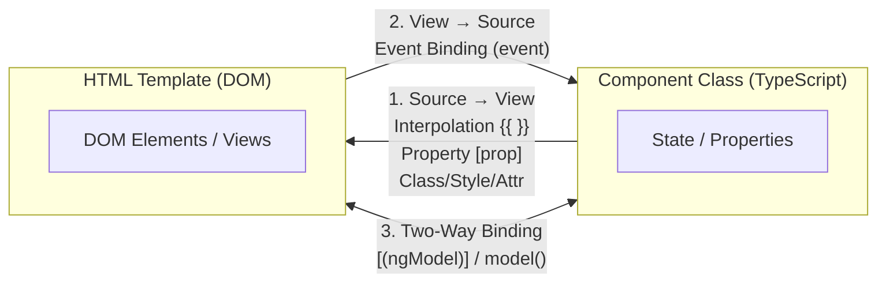

# 📘 02. Angular — Decorators & Data Binding

> **Topics:** Decorators Overview · Data Binding Concepts · Syntax Cheat Sheet · Interpolation · Property, Attribute, Class, Style & ARIA Bindings · Event Binding & Key Modifiers · Two-Way Binding (`ngModel` & `model()`)  
> **Source:** Strictly verified against official Angular documentation ([angular.dev](https://angular.dev)).

---

## 1. Decorators Overview

> A **Decorator** is a special TypeScript annotation prefixed with `@` that attaches metadata to classes, methods, or properties so Angular knows how to process and configure them.

### Core Angular Decorators

| Decorator | Target | Purpose |
| :--- | :--- | :--- |
| `@Component()` | Class | Marks a class as an Angular UI component with a template, styles, and selector |
| `@Directive()` | Class | Creates custom behaviors or modifies DOM elements |
| `@Pipe()` | Class | Defines reusable data transformation logic in templates |
| `@Injectable()` | Class | Registers a service class in Angular's Dependency Injection system |
| `@Input()` | Property | Marks a property as configurable from a parent component |
| `@Output()` | Property | Marks a property as an event producer that emits data to parent components |

---

## 2. What is Data Binding?

**Data binding** is the automatic synchronization of data between the TypeScript component class (**source**) and the HTML template (**view**).



---

## 3. Syntax Cheat Sheet

| Binding Type | Syntax | Data Flow Direction | Primary Use Case |
| :--- | :--- | :--- | :--- |
| **Interpolation** | `{{ value }}` | Source $\rightarrow$ View | Display text dynamically in DOM |
| **Property Binding** | `[property]="expression"` | Source $\rightarrow$ View | Set DOM object property (e.g., `disabled`, `src`) |
| **Attribute Binding** | `[attr.name]="expression"` | Source $\rightarrow$ View | Set HTML attribute (SVG, `colspan`, ARIA) |
| **Class Binding** | `[class.name]="condition"` | Source $\rightarrow$ View | Toggle single or multiple CSS classes |
| **Style Binding** | `[style.prop]="expression"` | Source $\rightarrow$ View | Apply inline CSS styles dynamically |
| **Event Binding** | `(event)="handler()"` | View $\rightarrow$ Source | Listen for DOM events (e.g., click, keyup) |
| **Two-Way Binding** | `[(ngModel)]="property"` | Source $\rightleftarrows$ View | Keep form inputs in sync with TS state |

> 💡 **Memory Helper:**
> - `[ ]` = **Data INTO element** (Property / Attribute / Class / Style binding)
> - `( )` = **Event OUT OF element** (Event binding)
> - `[( )]` = **Banana in a box** (Two-Way binding: both directions at once)

---

## 4. Interpolation — `{{ }}`

Interpolation evaluates a TypeScript expression and converts the result into plain text inside the HTML template.

```ts
import { Component, signal } from '@angular/core';

@Component({
  selector: 'app-user-greeting',
  template: `
    <h2>Welcome back, {{ userName }}!</h2>
    <p>Role: {{ userRole.toUpperCase() }}</p>
    <!-- Interpolation with Signals (Modern Angular) -->
    <p>Current Status: {{ userStatus() }}</p>
  `
})
export class UserGreetingComponent {
  userName = 'Alex';
  userRole = 'administrator';
  userStatus = signal('Active');
}
```

---

## 5. Property Binding — `[ ]`

Property binding binds a value to a **DOM Object property** (not the HTML string attribute).

```ts
import { Component, signal } from '@angular/core';

@Component({
  selector: 'app-profile-card',
  template: `
    <!-- Native element DOM property -->
    

    <!-- Button disabled state -->
    <button [disabled]="isSubmitting()">Submit Form</button>

    <!-- Passing property into a child component input -->
    <app-user-details [userId]="currentUserId"></app-user-details>
  `
})
export class ProfileCardComponent {
  avatarUrl = signal('https://example.com/avatar.png');
  userAltText = 'User avatar photo';
  isSubmitting = signal(false);
  currentUserId = 42;
}
```

---

## 6. Attribute Binding — `[attr.name]`

Used when a DOM element property does not exist (e.g., SVG attributes, `colspan`, `aria-*`, `role`).

```html
<!-- Table colspan binding -->
<td [attr.colspan]="columnSpanCount">Column content</td>

<!-- SVG attribute binding -->
<svg>
  <circle [attr.cx]="centerX" [attr.cy]="centerY" [attr.r]="radius"></circle>
</svg>

<!-- ARIA role binding -->
<div [attr.role]="userRole">Accessible Container</div>
```

*Note: If the bound expression resolves to `null` or `undefined`, Angular automatically removes the attribute from the DOM.*

---

## 7. Class Binding — `[class.className]` / `[class]`

Dynamically adds or removes CSS class names on an HTML element.

### Single Class Toggle
```html
<button [class.active]="isActive" [class.disabled]="isPending()">
  Click Me
</button>
```

### Multiple Classes (String, Array, or Object)
```ts
import { Component, signal } from '@angular/core';

@Component({
  selector: 'app-button-group',
  template: `
    <!-- Bind object of class names to boolean conditions -->
    <div [class]="classObject">Container</div>

    <!-- Bind array of class names -->
    <button [class]="classArray()">Dynamic Button</button>
  `
})
export class ButtonGroupComponent {
  classObject = {
    'btn': true,
    'btn-primary': true,
    'shadow-lg': false
  };

  classArray = signal(['card', 'padding-medium', 'rounded']);
}
```

---

## 8. Style Binding — `[style.propertyName]` / `[style]`

Applies inline CSS styles dynamically to template elements.

### Single Style Property with Units
```html
<!-- Direct property value -->
<div [style.color]="textColor">Colored Text</div>

<!-- Style property with explicit unit extension (.px, .rem, .%) -->
<div [style.width.px]="containerWidth" [style.font-size.rem]="fontSize">
  Sized Content
</div>
```

### Multiple Style Properties
```ts
import { Component, signal } from '@angular/core';

@Component({
  selector: 'app-styled-box',
  template: `
    <!-- Bind inline style string or object -->
    <div [style]="boxStyles()">Styled Container</div>
  `
})
export class StyledBoxComponent {
  boxStyles = signal({
    'background-color': '#f5f5f5',
    'border': '1px solid #ccc',
    'padding': '16px'
  });
}
```

---

## 9. ARIA Attribute Binding

For accessibility compliance (a11y), Angular supports direct binding to ARIA attributes:

```html
<button type="button" 
        [aria-label]="buttonLabel" 
        [attr.aria-expanded]="isMenuOpen()">
  Toggle Menu
</button>
```

---

## 10. Event Binding — `(event)`

Event binding listens for DOM events (e.g., clicks, keypresses, mouse movements) and triggers TypeScript methods.

```ts
import { Component } from '@angular/core';

@Component({
  selector: 'app-event-demo',
  template: `
    <!-- Simple click listener -->
    <button (click)="onSave()">Save</button>

    <!-- Passing the native DOM $event object -->
    <input type="text" (input)="onInputChange($event)" />

    <!-- Key Modifiers: Triggers only when Enter key is pressed -->
    <input type="text" (keyup.enter)="onSubmitSearch()" />

    <!-- Combined Key Modifiers: Shift + Enter -->
    <textarea (keyup.shift.enter)="onAddNewLine()"></textarea>
  `
})
export class EventDemoComponent {
  onSave(): void {
    console.log('Save button clicked!');
  }

  onInputChange(event: Event): void {
    const inputElement = event.target as HTMLInputElement;
    console.log('Current input value:', inputElement.value);
  }

  onSubmitSearch(): void {
    console.log('Search submitted via Enter key!');
  }

  onAddNewLine(): void {
    console.log('Shift + Enter pressed!');
  }
}
```

### Key Modifiers Supported by Angular
- `keyup.enter`
- `keyup.escape`
- `keyup.space`
- `keyup.arrowup` / `keyup.arrowdown`
- Combined modifiers: `keyup.control.enter`, `keyup.shift.enter`

---

## 11. Two-Way Data Binding — `[( )]`

Two-way binding combines property binding `[ ]` (data into template) and event binding `( )` (data out of template) into a single directive.

### 1. Form Control Binding with `ngModel`
Requires importing `FormsModule` from `@angular/forms`:

```ts
import { Component } from '@angular/core';
import { FormsModule } from '@angular/forms';

@Component({
  selector: 'app-form-demo',
  imports: [FormsModule],
  template: `
    <label for="username">Username:</label>
    <input id="username" type="text" [(ngModel)]="username" />

    <p>Live Preview: {{ username }}</p>
  `
})
export class FormDemoComponent {
  username = 'JohnDoe';
}
```

### 2. Custom Component Two-Way Binding with Signals (`model()`)
In modern Angular (v17.2+), component inputs can use `model()` to declare two-way bindable properties effortlessly:

#### Child Component (`counter.component.ts`)
```ts
import { Component, model } from '@angular/core';

@Component({
  selector: 'app-counter',
  template: `
    <button (click)="decrement()">-</button>
    <span>{{ count() }}</span>
    <button (click)="increment()">+</button>
  `
})
export class CounterComponent {
  // Two-way bindable model signal
  count = model<number>(0);

  increment(): void {
    this.count.update(c => c + 1);
  }

  decrement(): void {
    this.count.update(c => c - 1);
  }
}
```

#### Parent Component (`app.component.ts`)
```ts
import { Component, signal } from '@angular/core';
import { CounterComponent } from './counter.component';

@Component({
  selector: 'app-root',
  imports: [CounterComponent],
  template: `
    <h3>Parent Component Count: {{ itemCount() }}</h3>
    <!-- Two-way binding banana-in-a-box syntax -->
    <app-counter [(count)]="itemCount"></app-counter>
  `
})
export class AppComponent {
  itemCount = signal(10);
}
```

---

## 📚 Official References
- [angular.dev — Template Binding Guide](https://angular.dev/guide/templates/binding)
- [angular.dev — Event Listeners](https://angular.dev/guide/templates/event-listeners)
- [angular.dev — Two-Way Binding & Model Signals](https://angular.dev/guide/templates/two-way-binding)
