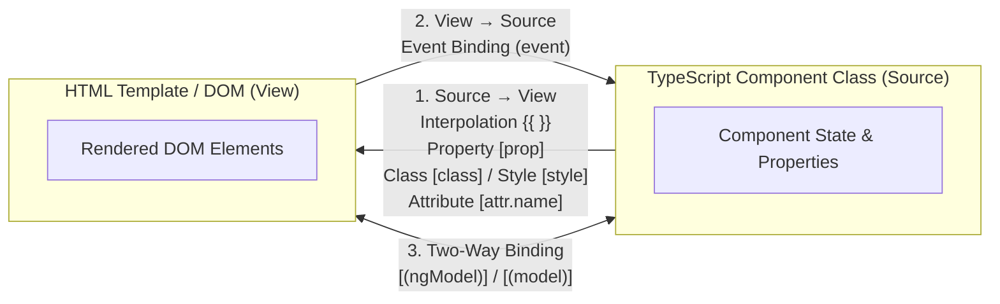

# 📘 02. Angular — Decorators & Data Binding

> **Topics:** Decorators Overview · Data Binding Concepts · Syntax Cheat Sheet · Interpolation · Property, Attribute, Class, Style & ARIA Bindings · Event Binding & Modifiers · Two-Way Binding (`ngModel` & Signal `model()`)  
> **Source:** Strictly verified against official Angular documentation ([angular.dev](https://angular.dev)).

---

## 1. Decorators Overview

> A **Decorator** is a special TypeScript function prefixed with `@` that attaches metadata to classes, methods, or properties so Angular knows how to configure and execute them.

### Core Angular Decorators

| Decorator | Target | Purpose | Modern Alternative (Signals) |
| :--- | :--- | :--- | :--- |
| `@Component()` | Class | Defines a UI component (template, styles, selector) | — |
| `@Directive()` | Class | Attaches custom behavior to DOM elements | — |
| `@Pipe()` | Class | Defines reusable data transformations in templates | — |
| `@Injectable()` | Class | Registers a service in Dependency Injection | — |
| `@Input()` | Property | Accepts input values from parent component | `input()` signal (v17.1+) |
| `@Output()` | Property | Emits custom events to parent component | `output()` function (v17.3+) |

---

### Concrete Examples for Each Class Decorator

#### 1. `@Component` (UI Building Block)
```ts
import { Component, signal } from '@angular/core';

@Component({
  selector: 'app-greeting',
  standalone: true,
  template: `<h2>Hello, {{ name() }}!</h2>`,
  styles: [`h2 { color: #2563eb; }`]
})
export class GreetingComponent {
  name = signal('Angular Learner');
}
```

#### 2. `@Directive` (Custom DOM Behavior)
```ts
import { Directive, ElementRef, HostListener, inject } from '@angular/core';

@Directive({
  selector: '[appHighlight]',
  standalone: true
})
export class HighlightDirective {
  private el = inject(ElementRef);

  @HostListener('mouseenter') onMouseEnter() {
    this.el.nativeElement.style.backgroundColor = 'yellow';
  }

  @HostListener('mouseleave') onMouseLeave() {
    this.el.nativeElement.style.backgroundColor = '';
  }
}
```

#### 3. `@Pipe` (Data Transformation)
```ts
import { Pipe, PipeTransform } from '@angular/core';

@Pipe({
  name: 'truncate',
  standalone: true
})
export class TruncatePipe implements PipeTransform {
  transform(value: string, limit = 20): string {
    if (!value) return '';
    return value.length > limit ? value.substring(0, limit) + '...' : value;
  }
}
```

#### 4. `@Injectable` (Shared Service)
```ts
import { Injectable, signal } from '@angular/core';

@Injectable({
  providedIn: 'root' // Singleton available application-wide
})
export class NotificationService {
  messages = signal<string[]>([]);

  addMessage(msg: string): void {
    this.messages.update(list => [...list, msg]);
  }
}
```

---

## 2. What is Data Binding?

**Data binding** is the automatic synchronization of state between the TypeScript component class (**Source**) and the HTML template (**View**).



---

## 3. Syntax Cheat Sheet

| Binding Type | Syntax | Data Flow | Common Use Case |
| :--- | :--- | :--- | :--- |
| **Interpolation** | `{{ value }}` | Source $\rightarrow$ View | Render text strings in the DOM |
| **Property Binding** | `[property]="value"` | Source $\rightarrow$ View | Bind to DOM element properties (`src`, `disabled`) |
| **Attribute Binding** | `[attr.name]="value"` | Source $\rightarrow$ View | Bind to HTML attributes (`colspan`, `aria-*`, SVG) |
| **Class Binding** | `[class.active]="bool"` | Source $\rightarrow$ View | Toggle CSS classes dynamically |
| **Style Binding** | `[style.color]="val"` | Source $\rightarrow$ View | Set inline CSS styles dynamically |
| **Event Binding** | `(event)="handler()"` | View $\rightarrow$ Source | Listen to user interactions (click, input, keyup) |
| **Two-Way Binding** | `[(ngModel)]="val"` | Source $\rightleftarrows$ View | Keep form inputs & TS state in bidirectional sync |

> 💡 **Syntax Memory Rule:**
> - `[ ]` = **Square brackets**: Data flowing **INTO** the element (Properties/Styles).
> - `( )` = **Parentheses**: Events flowing **OUT OF** the element (Actions/Listeners).
> - `[( )]` = **Banana in a box**: Both directions simultaneously (**Two-Way Binding**).

---

## 4. Interpolation — `{{ }}`

Interpolation evaluates TypeScript expressions and inserts the resulting string into the HTML template.

```ts
import { Component, signal, computed } from '@angular/core';

@Component({
  selector: 'app-interpolation-demo',
  standalone: true,
  template: `
    <!-- 1. Simple Property -->
    <h2>Welcome, {{ username }}</h2>

    <!-- 2. Expressions & String Methods -->
    <p>Role: {{ role.toUpperCase() }}</p>
    <p>Status: {{ isOnline ? '🟢 Online' : '🔴 Offline' }}</p>
    <p>Next Year: {{ currentYear + 1 }}</p>

    <!-- 3. Signals (Invoked as functions in templates) -->
    <p>Unread Messages: {{ unreadCount() }}</p>
    <p>Summary: {{ summary() }}</p>
  `
})
export class InterpolationDemoComponent {
  username = 'Sarah Connor';
  role = 'engineer';
  isOnline = true;
  currentYear = 2026;

  // Signals
  unreadCount = signal(5);
  summary = computed(() => `You have ${this.unreadCount()} pending notifications.`);
}
```

### ⚠️ What is NOT Allowed in Interpolation
- Assignments (`{{ x = 10 }}`)
- Increment / decrement operators (`{{ count++ }}`)
- New instance creation (`{{ new Date() }}`)
- Bitwise operators or JavaScript keywords (`typeof`, `instanceof`)

---

## 5. Property Binding — `[ ]`

Property binding sets a value directly on a **DOM Object property** (not the HTML string attribute).

```ts
import { Component, signal } from '@angular/core';

@Component({
  selector: 'app-property-demo',
  standalone: true,
  template: `
    <!-- 1. Binding to DOM element properties -->
    

    <!-- 2. Boolean property (disabled, checked, hidden) -->
    <button [disabled]="isSubmitting()">Submit Application</button>

    <!-- 3. Dynamic href on links -->
    <a [href]="dashboardUrl">Go to Dashboard</a>
  `
})
export class PropertyDemoComponent {
  avatarUrl = signal('https://angular.dev/assets/images/press-kit/angular_wordmark.svg');
  avatarAlt = 'Angular Logo';
  isSubmitting = signal(false);
  dashboardUrl = '/dashboard';
}
```

---

## 6. Attribute Binding — `[attr.name]`

HTML attributes and DOM properties are different:
- **Attributes** are defined in HTML markup to initialize elements.
- **Properties** exist on DOM object nodes in JavaScript.

When a DOM element does not have a matching property (e.g. `colspan`, SVG attributes, `aria-*`), use `[attr.attributeName]`.

```html
<!-- Table column span (no 'colspan' property on HTMLTableCellElement, only HTML attribute) -->
<td [attr.colspan]="colSpanSize">Merged Table Header</td>

<!-- SVG coordinates (SVG attributes must be bound via attr) -->
<svg width="100" height="100">
  <circle [attr.cx]="centerX" [attr.cy]="centerY" [attr.r]="radius" fill="red" />
</svg>

<!-- Custom data attribute -->
<div [attr.data-user-id]="userId">User Container</div>
```

> 💡 **Note:** When the expression evaluates to `null` or `undefined`, Angular automatically removes the attribute from the DOM element.

---

## 7. Class Binding — `[class]` & `[ngClass]`

Dynamically applies or removes CSS classes.

### 1. Native Class Binding — `[class]` / `[class.name]`
```ts
import { Component, signal } from '@angular/core';

@Component({
  selector: 'app-class-binding-demo',
  standalone: true,
  template: `
    <!-- 1. Single class toggle based on boolean condition -->
    <div [class.active]="isActive()">Active Box</div>
    <div [class.is-loading]="isPending()">Loading Box</div>

    <!-- 2. Multiple classes as an Object (class name -> boolean) -->
    <div [class]="boxClasses">Styled Container</div>

    <!-- 3. Multiple classes as an Array or String -->
    <button [class]="buttonClassList()">Status Button</button>
  `,
  styles: [`
    .active { border-left: 4px solid #10b981; }
    .is-loading { opacity: 0.6; }
    .card { padding: 1rem; }
    .shadow { box-shadow: 0 4px 6px -1px rgb(0 0 0 / 0.1); }
    .btn-primary { background: #2563eb; color: white; border-radius: 4px; }
  `]
})
export class ClassBindingDemoComponent {
  isActive = signal(true);
  isPending = signal(false);

  boxClasses = {
    'card': true,
    'shadow': true,
    'active': false
  };

  buttonClassList = signal(['btn-primary', 'shadow']);
}
```

### 2. `[ngClass]` Directive (from `CommonModule`)
Used to apply multiple classes conditionally via an object map:
```html
<div [ngClass]="{'active': isActive(), 'disabled': isDisabled()}">
  Dynamic State Box
</div>
```

---

## 8. Style Binding — `[style]` & `[ngStyle]`

Applies inline CSS styles directly to template elements.

### 1. Native Style Binding — `[style]` / `[style.property]`
```ts
import { Component, signal } from '@angular/core';

@Component({
  selector: 'app-style-binding-demo',
  standalone: true,
  template: `
    <!-- 1. Single style property -->
    <p [style.color]="textColor()">Dynamic Text Color</p>

    <!-- 2. Style property with unit suffix (.px, .rem, .%, .em) -->
    <div [style.width.px]="boxWidth()" [style.font-size.rem]="fontSizeRem">
      Sized Box
    </div>

    <!-- 3. Multiple styles via an object -->
    <div [style]="customStyles">Custom Styled Panel</div>
  `
})
export class StyleBindingDemoComponent {
  textColor = signal('#dc2626');
  boxWidth = signal(250);
  fontSizeRem = 1.25;

  customStyles = {
    backgroundColor: '#f3f4f6',
    border: '1px solid #d1d5db',
    padding: '12px 16px',
    borderRadius: '6px'
  };
}
```

### 2. `[ngStyle]` Directive (from `CommonModule`)
Used to apply multiple inline CSS styles dynamically via a key-value object:
```html
<div [ngStyle]="{'color': textColor(), 'font-size': '18px', 'font-weight': 'bold'}">
  Styled with NgStyle
</div>
```

---

## 9. Template Reference Variables — `#`

A **Template Reference Variable** (declared with `#varName`) creates a local reference to a DOM element, custom component, or directive inside the HTML template.

```ts
import { Component } from '@angular/core';

@Component({
  selector: 'app-template-ref-demo',
  standalone: true,
  template: `
    <!-- #phone is a reference to the HTMLInputElement -->
    <input #phone type="tel" placeholder="Enter phone number..." />
    
    <!-- Pass element value or trigger DOM methods directly in template -->
    <button (click)="submitPhone(phone.value)">Submit</button>
    <button (click)="phone.focus()">Focus Input</button>
  `
})
export class TemplateRefDemoComponent {
  submitPhone(phoneValue: string) {
    console.log('Submitted phone:', phoneValue);
  }
}
```

---

## 10. Accessibility (ARIA) Binding

For web accessibility (a11y), bind directly to ARIA properties or attributes:

```html
<!-- Direct ARIA property or attribute binding -->
<button type="button"
        [attr.aria-expanded]="isMenuOpen()"
        [attr.aria-label]="menuLabel"
        (click)="toggleMenu()">
  ☰ Menu
</button>

<div role="region" [attr.aria-hidden]="!isMenuOpen()">
  <nav>Navigation items...</nav>
</div>
```

---

## 11. Event Binding — `(event)`

Event binding captures DOM events (clicks, inputs, keypresses) and triggers TypeScript methods.

```ts
import { Component, signal } from '@angular/core';

@Component({
  selector: 'app-event-demo',
  standalone: true,
  template: `
    <!-- 1. Basic click event -->
    <button (click)="onSave()">Save Item</button>

    <!-- 2. Accessing DOM $event object -->
    <input type="text" (input)="onTextInput($event)" placeholder="Type here..." />

    <!-- 3. Keyup Modifiers (Filter specific keys) -->
    <input type="text" (keyup.enter)="onSearch()" placeholder="Press Enter to search" />
    <input type="text" (keyup.escape)="onCancel()" placeholder="Press Escape to cancel" />

    <!-- 4. Combined Key Modifiers (Shift + Enter) -->
    <textarea (keyup.shift.enter)="onSubmitMultiLine()" placeholder="Shift + Enter to submit"></textarea>
  `
})
export class EventDemoComponent {
  searchQuery = signal('');

  onSave(): void {
    console.log('Saved successfully!');
  }

  onTextInput(event: Event): void {
    const input = event.target as HTMLInputElement;
    console.log('Input value:', input.value);
  }

  onSearch(): void {
    console.log('Search triggered via Enter key!');
  }

  onCancel(): void {
    console.log('Action cancelled via Escape key!');
  }

  onSubmitMultiLine(): void {
    console.log('Submitted via Shift + Enter!');
  }
}
```

### Supported Key Modifiers
- `(keyup.enter)`
- `(keyup.escape)`
- `(keyup.space)`
- `(keyup.arrowup)` / `(keyup.arrowdown)`
- Combined: `(keyup.control.enter)`, `(keyup.shift.enter)`

---

## 12. Two-Way Data Binding — `[( )]`

Two-way binding synchronizes data in both directions simultaneously:
- When the TypeScript state changes $\rightarrow$ the template updates.
- When the user changes the UI input $\rightarrow$ the TypeScript state updates.

### Approach 1: Form Inputs with `[(ngModel)]` (Template-Driven Forms)
Requires importing `FormsModule` from `@angular/forms`:

```ts
import { Component } from '@angular/core';
import { FormsModule } from '@angular/forms';

@Component({
  selector: 'app-ngmodel-demo',
  standalone: true,
  imports: [FormsModule],
  template: `
    <label for="nameInput">Name:</label>
    <input id="nameInput" type="text" [(ngModel)]="userName" />

    <p>Live Output: <strong>{{ userName }}</strong></p>
  `
})
export class NgModelDemoComponent {
  userName = 'Jane Doe';
}
```

---

### Approach 2: Component Two-Way Binding with Signals (`model()`)

Modern Angular (v17.2+) provides `model()` to declare two-way bindable properties between parent and child components with zero boilerplate:

#### Child Component (`rating.component.ts`)
```ts
import { Component, model } from '@angular/core';

@Component({
  selector: 'app-rating',
  standalone: true,
  template: `
    <div class="rating-controls">
      <button (click)="decrease()">-</button>
      <span>Rating: {{ value() }} / 5</span>
      <button (click)="increase()">+</button>
    </div>
  `
})
export class RatingComponent {
  // Two-way bindable signal model
  value = model<number>(1);

  increase(): void {
    if (this.value() < 5) {
      this.value.update(v => v + 1);
    }
  }

  decrease(): void {
    if (this.value() > 1) {
      this.value.update(v => v - 1);
    }
  }
}
```

#### Parent Component (`app.component.ts`)
```ts
import { Component, signal } from '@angular/core';
import { RatingComponent } from './rating.component';

@Component({
  selector: 'app-root',
  standalone: true,
  imports: [RatingComponent],
  template: `
    <h2>Product Review</h2>
    <!-- Banana-in-a-box syntax binds parent signal to child model -->
    <app-rating [(value)]="productScore"></app-rating>

    <p>Parent Signal Score: {{ productScore() }}</p>
  `
})
export class AppComponent {
  productScore = signal(4);
}
```

> 🔍 **Under the Hood:**  
> `[(value)]="productScore"` is syntactic sugar for:  
> `[value]="productScore()" (valueChange)="productScore.set($event)"`

---

## 📚 Official References

- [angular.dev — Template Binding Overview](https://angular.dev/guide/templates/binding)
- [angular.dev — Event Listeners & Modifiers](https://angular.dev/guide/templates/event-listeners)
- [angular.dev — Two-Way Binding & Signal Models](https://angular.dev/guide/templates/two-way-binding)
- [angular.dev — Signal Inputs & Outputs](https://angular.dev/guide/signals/inputs)
