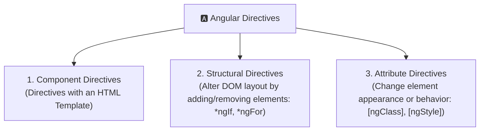
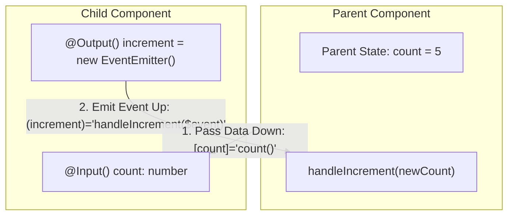
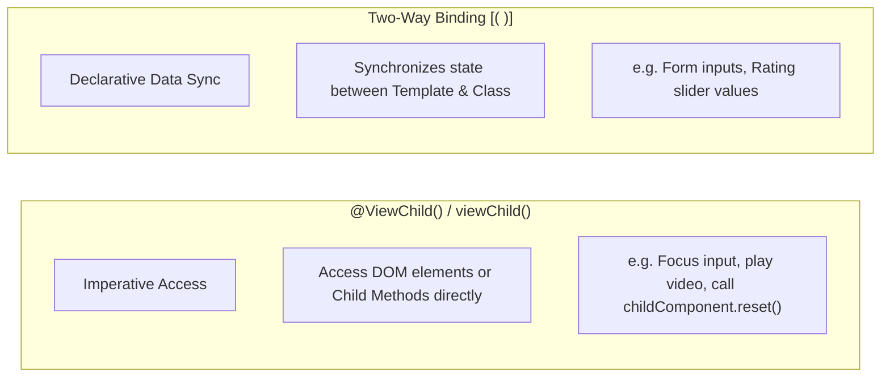
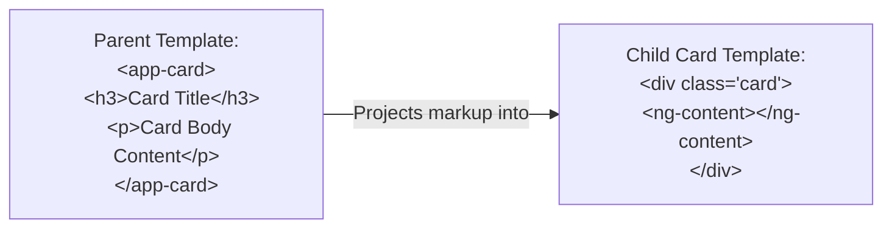

# 📘 03. Angular — Directives, Component Communication & Content Projection

> **Topics:** Directives Overview · Structural Directives (`*ngIf`, `*ngFor` + `trackBy`, `*ngSwitch`) · Modern Control Flow (`@if`, `@for`, `@switch`) · Attribute Directives (`[ngClass]`, `[ngStyle]`) · Template Reference Variables (`#`) · Parent-Child Communication (`@Input`, `@Output`, `EventEmitter`) · `@ViewChild` vs Two-Way Binding · Content Projection (`<ng-content>`)  
> **Source:** Strictly verified against official Angular documentation ([angular.dev](https://angular.dev)).

---

## 1. Directives Overview

> A **Directive** is a TypeScript class with the `@Directive()` (or `@Component()`) decorator that adds custom behavior, styling, or structural modification to elements in the DOM.

In simple terms: **A Directive is a set of instructions passed to the DOM.**



### The 3 Types of Directives

| Directive Type | Has Template? | Purpose | Examples |
| :--- | :--- | :--- | :--- |
| **Component** | ✅ Yes | Directives with a template; the primary UI building block. | `<app-user-card>`, `<app-navbar>` |
| **Structural** | ❌ No | Alters DOM layout by **adding, removing, or replacing** DOM elements. Prefixed with an asterisk (`*`). | `*ngIf`, `*ngFor`, `*ngSwitch` |
| **Attribute** | ❌ No | Changes the **appearance or behavior** of an existing DOM element, component, or another directive. | `[ngClass]`, `[ngStyle]`, `[appHighlight]` |

---

## 2. Structural Directives — `*ngIf`, `*ngFor` & `*ngSwitch`

Structural directives reshape the DOM tree. The asterisk (`*`) is syntactic sugar that wraps the host element inside an `<ng-template>`.

> 💡 **Prerequisite for Standalone Components:**  
> When using `*ngIf`, `*ngFor`, `*ngSwitch`, `[ngClass]`, or `[ngStyle]`, import `CommonModule` from `@angular/common` (or the specific directive) in your component's `imports: [...]`.

---

### 1. `*ngIf` — Conditional Rendering

Renders or destroys a DOM element based on a boolean condition:

```ts
import { Component, signal } from '@angular/core';
import { CommonModule } from '@angular/common';

@Component({
  selector: 'app-ngif-demo',
  standalone: true,
  imports: [CommonModule],
  template: `
    <button (click)="isLoggedIn.set(!isLoggedIn())">
      Toggle Login State
    </button>

    <!-- 1. Simple *ngIf -->
    <p *ngIf="isLoggedIn()">Welcome back, User! 👋</p>

    <!-- 2. *ngIf with else template -->
    <div *ngIf="isLoggedIn(); else guestBlock">
      <p>Dashboard is visible</p>
    </div>

    <!-- Fallback template -->
    <ng-template #guestBlock>
      <p>Please log in to continue.</p>
    </ng-template>
  `
})
export class NgIfDemoComponent {
  isLoggedIn = signal(true);
}
```

#### Modern Angular Alternative: `@if` (Recommended)
```html
@if (isLoggedIn()) {
  <p>Welcome back, User! 👋</p>
} @else {
  <p>Please log in to continue.</p>
}
```

---

### 2. `*ngFor` & `trackBy` — Iterating Lists & Performance Optimization

Iterates over an array and renders a template for each item.

```ts
import { Component, signal } from '@angular/core';
import { CommonModule } from '@angular/common';

interface Product {
  id: number;
  name: string;
  price: number;
}

@Component({
  selector: 'app-ngfor-demo',
  standalone: true,
  imports: [CommonModule],
  template: `
    <h3>Product List</h3>
    <ul>
      <!-- *ngFor with exported local variables and trackBy -->
      <li *ngFor="let product of products(); let i = index; let isEven = even; trackBy: trackById"
          [style.background-color]="isEven ? '#f9fafb' : '#ffffff'">
        <span>#{{ i + 1 }} - {{ product.name }} ($ {{ product.price }})</span>
      </li>
    </ul>
  `
})
export class NgForDemoComponent {
  products = signal<Product[]>([
    { id: 101, name: 'Keyboard', price: 79 },
    { id: 102, name: 'Mouse', price: 49 },
    { id: 103, name: 'Monitor', price: 299 }
  ]);

  // trackBy function for performance optimization
  trackById(index: number, product: Product): number {
    return product.id;
  }
}
```

#### ⚡ Why is `trackBy` / `track` crucial for Performance?
> [!IMPORTANT]
> - **Without `trackBy`:** When the array changes (e.g. refreshed from an API), Angular destroys and recreates **all** DOM elements in the list, even if only one item was updated. This causes DOM churn, lost focus, and sluggish UI.
> - **With `trackBy`:** Angular tracks items by unique identity (e.g., `id`). It only adds, removes, or reorders the specific DOM elements that actually changed.

#### Modern Angular Alternative: `@for` with Built-in `track`
Modern Angular requires `track` directly in the template:
```html
<ul>
  @for (product of products(); track product.id; let i = $index) {
    <li>#{{ i + 1 }} - {{ product.name }} ($ {{ product.price }})</li>
  } @empty {
    <li>No products found.</li>
  }
</ul>
```

---

### 3. `*ngSwitch` — Multi-branch Conditional Rendering

Displays one matching element among multiple choices:

```ts
import { Component, signal } from '@angular/core';
import { CommonModule } from '@angular/common';

@Component({
  selector: 'app-ngswitch-demo',
  standalone: true,
  imports: [CommonModule],
  template: `
    <div [ngSwitch]="userRole()">
      <p *ngSwitchCase="'admin'">👑 Admin Panel: Full Access Granted</p>
      <p *ngSwitchCase="'editor'">✏️ Editor Panel: Edit & Publish Content</p>
      <p *ngSwitchCase="'subscriber'">📖 Subscriber Panel: Read-only Access</p>
      <p *ngSwitchDefault>❓ Unknown Role: Contact Support</p>
    </div>
  `
})
export class NgSwitchDemoComponent {
  userRole = signal<'admin' | 'editor' | 'subscriber' | 'guest'>('editor');
}
```

#### Modern Angular Alternative: `@switch`
```html
@switch (userRole()) {
  @case ('admin') { <p>👑 Admin Panel</p> }
  @case ('editor') { <p>✏️ Editor Panel</p> }
  @default { <p>❓ Unknown Role</p> }
}
```

---

## 3. Attribute Directives — `[ngClass]` & `[ngStyle]`

Attribute directives modify the appearance or styling of DOM elements.

### 1. `[ngClass]` — Dynamic Class Binding

Applies CSS classes based on objects, arrays, or strings:

```ts
import { Component, signal } from '@angular/core';
import { CommonModule } from '@angular/common';

@Component({
  selector: 'app-ngclass-demo',
  standalone: true,
  imports: [CommonModule],
  template: `
    <!-- 1. Object Syntax (Class is applied if expression is true) -->
    <div [ngClass]="{
      'badge-success': status() === 'active',
      'badge-danger': status() === 'inactive',
      'badge-warning': isPending()
    }">
      Status: {{ status() }}
    </div>

    <!-- 2. Array / String Syntax -->
    <button [ngClass]="['btn', 'btn-rounded', isLarge() ? 'btn-lg' : 'btn-sm']">
      Action Button
    </button>
  `,
  styles: [`
    .badge-success { background: #10b981; color: white; padding: 4px 8px; border-radius: 4px; }
    .badge-danger { background: #ef4444; color: white; padding: 4px 8px; border-radius: 4px; }
    .badge-warning { background: #f59e0b; color: white; padding: 4px 8px; border-radius: 4px; }
    .btn { padding: 8px 16px; border: none; cursor: pointer; }
    .btn-rounded { border-radius: 20px; }
    .btn-lg { font-size: 1.25rem; }
    .btn-sm { font-size: 0.875rem; }
  `]
})
export class NgClassDemoComponent {
  status = signal<'active' | 'inactive'>('active');
  isPending = signal(false);
  isLarge = signal(true);
}
```

---

### 2. `[ngStyle]` — Dynamic Inline Style Binding

Applies multiple inline CSS styles dynamically:

```ts
import { Component, signal } from '@angular/core';
import { CommonModule } from '@angular/common';

@Component({
  selector: 'app-ngstyle-demo',
  standalone: true,
  imports: [CommonModule],
  template: `
    <!-- Dynamically computed style object -->
    <div [ngStyle]="{
      'color': themeColor(),
      'font-size': fontSize() + 'px',
      'border': isHighlighted() ? '2px dashed ' + themeColor() : '1px solid #ccc',
      'padding': '12px',
      'border-radius': '8px'
    }">
      Custom Styled Card
    </div>
  `
})
export class NgStyleDemoComponent {
  themeColor = signal('#2563eb');
  fontSize = signal(16);
  isHighlighted = signal(true);
}
```

---

## 4. Template Reference Variables (`#`)

> A **Template Reference Variable** (`#varName`) is a reference to a DOM element, an Angular component instance, or a directive within a template.

### Common Use Cases:

```ts
import { Component } from '@angular/core';

@Component({
  selector: 'app-template-ref-demo',
  standalone: true,
  template: `
    <!-- 1. Referencing standard HTML DOM element -->
    <input #userPhone type="tel" placeholder="Enter phone number" />
    <button (click)="callUser(userPhone.value)">Call</button>
    <button (click)="userPhone.focus()">Focus Input</button>

    <!-- 2. Reading element properties directly in template -->
    <input #nameInput type="text" placeholder="Your name" />
    <p>Live Character Count: {{ nameInput.value.length }}</p>
  `
})
export class TemplateRefDemoComponent {
  callUser(phoneNumber: string): void {
    console.log('Calling phone number:', phoneNumber);
  }
}
```

> 💡 **Scope:** Template reference variables are accessible **anywhere within the same template**.

---

## 5. Component Communication (Parent $\rightleftarrows$ Child)

Components communicate hierarchically:
- **Parent to Child:** Uses **`@Input()`** property binding `[childProp]="parentVal"`.
- **Child to Parent:** Uses **`@Output()`** with **`EventEmitter`** event binding `(childEvent)="parentMethod($event)"`.



### Complete Code Example

#### 1. Child Component (`counter-display.component.ts`)
```ts
import { Component, Input, Output, EventEmitter } from '@angular/core';

@Component({
  selector: 'app-counter-display',
  standalone: true,
  template: `
    <div class="child-box">
      <h4>Child Component</h4>
      <!-- Display data received from Parent via @Input -->
      <p>Current Count: <strong>{{ count }}</strong></p>

      <!-- Trigger @Output event to notify Parent -->
      <button (click)="onIncrement()">+ Increment in Child</button>
    </div>
  `,
  styles: [`
    .child-box { border: 2px dashed #3b82f6; padding: 1rem; border-radius: 8px; }
  `]
})
export class CounterDisplayComponent {
  // @Input receives data from parent
  @Input() count: number = 0;

  // @Output emits custom events to parent
  @Output() countChange = new EventEmitter<number>();

  onIncrement(): void {
    // Emit new value to parent
    this.countChange.emit(this.count + 1);
  }
}
```

#### 2. Parent Component (`app.component.ts`)
```ts
import { Component, signal } from '@angular/core';
import { CounterDisplayComponent } from './counter-display.component';

@Component({
  selector: 'app-root',
  standalone: true,
  imports: [CounterDisplayComponent],
  template: `
    <div class="parent-box">
      <h2>Parent Component</h2>
      <p>Parent Total: {{ totalCount() }}</p>

      <!-- [count] passes data down, (countChange) catches emitted event -->
      <app-counter-display
        [count]="totalCount()"
        (countChange)="onCountChanged($event)">
      </app-counter-display>
    </div>
  `,
  styles: [`
    .parent-box { border: 2px solid #10b981; padding: 1.5rem; border-radius: 10px; }
  `]
})
export class AppComponent {
  totalCount = signal(10);

  onCountChanged(newVal: number): void {
    this.totalCount.set(newVal);
  }
}
```

#### Modern Angular Alternative: Signal `input()` & `output()`
```ts
// Child component (Angular 17+)
import { Component, input, output } from '@angular/core';

@Component({
  selector: 'app-counter-display',
  standalone: true,
  template: `
    <p>Count: {{ count() }}</p>
    <button (click)="countChange.emit(count() + 1)">Increment</button>
  `
})
export class CounterDisplayComponent {
  count = input<number>(0);            // Signal Input
  countChange = output<number>();      // Output function
}
```

---

## 6. `@ViewChild` vs. Two-Way Binding

Learners often wonder when to use `@ViewChild` vs **Two-Way Binding** (`[(ngModel)]` / `model()`).



### Detailed Comparison

| Feature | `@ViewChild()` | Two-Way Binding (`[(ngModel)]` / `model()`) |
| :--- | :--- | :--- |
| **Paradigm** | **Imperative** (Directly calls methods or inspects DOM/child instance) | **Declarative** (Data values automatically stay in sync) |
| **How it Works** | Queries the template for `#templateRef` or component/directive type | Syntactic sugar for `[value]` + `(valueChange)` |
| **Best Used For** | • Triggering focus/blur on input elements<br>• Calling child component methods (e.g., `modal.open()`)<br>• Accessing `<canvas>` or `<video>` native DOM elements | • Form inputs & controls<br>• Custom form components<br>• Bidirectional signal state syncing |
| **Code Access** | Inside TypeScript via `ngAfterViewInit` / Signals | Directly bound in HTML template |

---

### `@ViewChild` Code Example

```ts
import { Component, ViewChild, ElementRef, AfterViewInit } from '@angular/core';

@Component({
  selector: 'app-view-child-demo',
  standalone: true,
  template: `
    <!-- Template Reference Variable #searchInput -->
    <input #searchInput type="text" placeholder="Auto-focused on load..." />
    <button (click)="clearInput()">Clear</button>
  `
})
export class ViewChildDemoComponent implements AfterViewInit {
  // Queries #searchInput in the template
  @ViewChild('searchInput') inputElement!: ElementRef<HTMLInputElement>;

  ngAfterViewInit(): void {
    // Access native DOM element imperatively after view renders
    this.inputElement.nativeElement.focus();
  }

  clearInput(): void {
    this.inputElement.nativeElement.value = '';
    this.inputElement.nativeElement.focus();
  }
}
```

#### Modern Angular Alternative: `viewChild()` Signal Query
```ts
import { Component, viewChild, ElementRef, effect } from '@angular/core';

export class ViewChildDemoComponent {
  searchInput = viewChild<ElementRef<HTMLInputElement>>('searchInput');

  constructor() {
    effect(() => {
      this.searchInput()?.nativeElement.focus();
    });
  }
}
```

---

## 7. Content Projection — `<ng-content>`

> **Content Projection** (also known as *transclusion* or *slots*) allows a component to insert/project HTML elements passed from the parent component inside its own template.



### 1. Single-Slot Content Projection

#### Child Component (`card.component.ts`)
```ts
import { Component } from '@angular/core';

@Component({
  selector: 'app-card',
  standalone: true,
  template: `
    <div class="card-container">
      <!-- Projected content from parent will appear here -->
      <ng-content></ng-content>
    </div>
  `,
  styles: [`
    .card-container { border: 1px solid #e5e7eb; padding: 1.5rem; border-radius: 8px; box-shadow: 0 2px 4px rgba(0,0,0,0.05); }
  `]
})
export class CardComponent {}
```

#### Parent Usage:
```html
<app-card>
  <h3>📦 Reusable Card Title</h3>
  <p>This paragraph is projected directly into the card component slot!</p>
</app-card>
```

---

### 2. Multi-Slot Content Projection (`select` attribute)

You can define multiple designated slots using CSS selectors (`select="[attr]"` or `select="tag-name"`):

#### Child Component (`dialog.component.ts`)
```ts
import { Component } from '@angular/core';

@Component({
  selector: 'app-dialog',
  standalone: true,
  template: `
    <div class="dialog">
      <header class="dialog-header">
        <ng-content select="[dialog-header]"></ng-content>
      </header>

      <section class="dialog-body">
        <ng-content select="[dialog-body]"></ng-content>
      </section>

      <footer class="dialog-footer">
        <ng-content select="[dialog-footer]"></ng-content>
      </footer>
    </div>
  `,
  styles: [`
    .dialog { border: 1px solid #333; border-radius: 8px; overflow: hidden; }
    .dialog-header { background: #f3f4f6; padding: 12px; font-weight: bold; }
    .dialog-body { padding: 16px; }
    .dialog-footer { background: #f9fafb; padding: 12px; text-align: right; }
  `]
})
export class DialogComponent {}
```

#### Parent Usage:
```html
<app-dialog>
  <h3 dialog-header>⚠️ Confirm Deletion</h3>
  <p dialog-body>Are you sure you want to delete this item? This cannot be undone.</p>
  <div dialog-footer>
    <button>Cancel</button>
    <button style="background: red; color: white;">Delete</button>
  </div>
</app-dialog>
```

---

## 8. Summary & Quick Reference

| Feature | Syntax | Purpose |
| :--- | :--- | :--- |
| `*ngIf` / `@if` | `*ngIf="condition"` | Conditionally renders/destroys elements in the DOM. |
| `*ngFor` / `@for` | `*ngFor="let item of items; trackBy: fn"` | Iterates over arrays. `trackBy` / `track` is essential for DOM performance. |
| `*ngSwitch` / `@switch` | `[ngSwitch]="val"`, `*ngSwitchCase="x"` | Multi-case conditional rendering. |
| `[ngClass]` | `[ngClass]="{'active': isOnline}"` | Adds/removes CSS classes dynamically via objects/arrays. |
| `[ngStyle]` | `[ngStyle]="{'color': textColor}"` | Sets dynamic inline CSS styles via style objects. |
| `#var` | `<input #inputRef>` | Template Reference Variable referencing a DOM element, directive, or component. |
| `@Input()` / `input()` | `[childInput]="parentData"` | Passes data down from parent component to child. |
| `@Output()` / `output()` | `(childEvent)="handler($event)"` | Emits custom events up from child component to parent. |
| `@ViewChild()` | `@ViewChild('ref') el!: ElementRef` | Imperative TypeScript access to a child component or DOM element. |
| `<ng-content>` | `<ng-content select="[slot]">` | Content projection (transclusion) to insert parent markup into child templates. |

---

## 📚 Official References

- [angular.dev — Directives Overview](https://angular.dev/guide/directives)
- [angular.dev — Structural Directives](https://angular.dev/guide/directives/structural-directives)
- [angular.dev — Built-in Control Flow (@if, @for, @switch)](https://angular.dev/guide/templates/control-flow)
- [angular.dev — Component Communication & Inputs/Outputs](https://angular.dev/guide/components/inputs)
- [angular.dev — Template Reference Variables](https://angular.dev/guide/templates/variables)
- [angular.dev — Content Projection](https://angular.dev/guide/components/content-projection)
