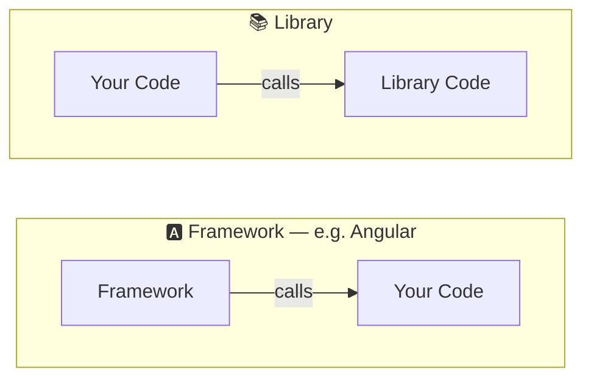
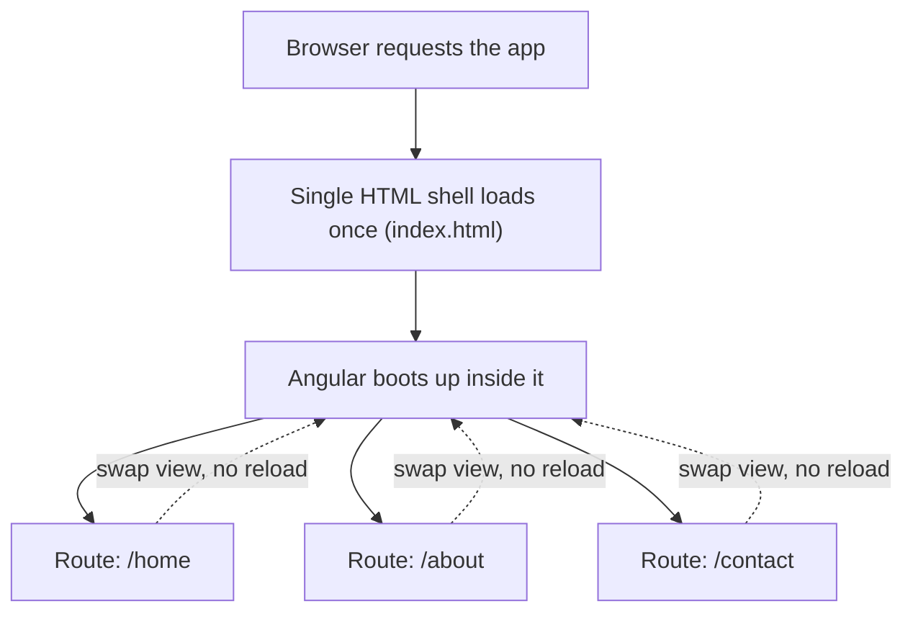
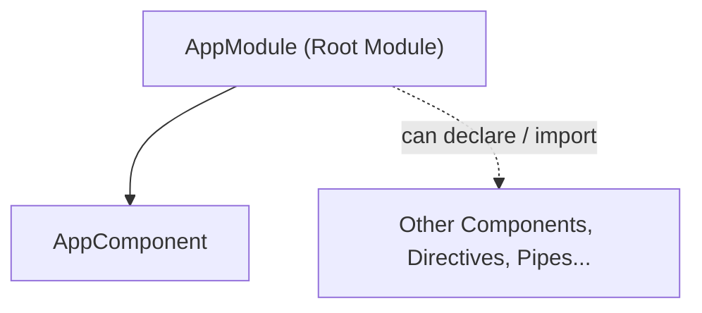
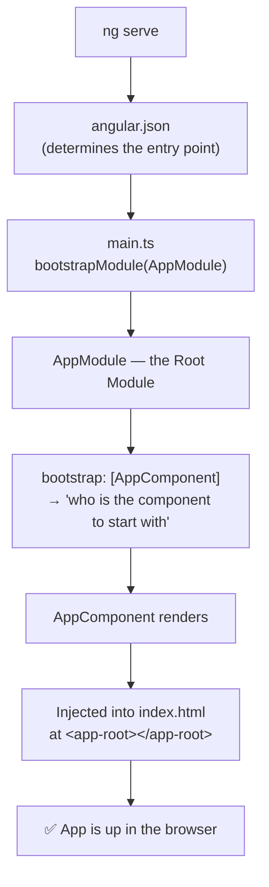

# 📘 Angular — Day 1

> Topics: What is Angular · Framework vs Library · Single Page Applications · CLI basics · Module vs Component · The `ng serve` boot flow

---

## 1. What is Angular?

> A **JS framework** which allows us to build and create **Single Page Applications (SPA)**.

Angular isn't just a UI library — it's a full framework with its own conventions for structure, routing, dependency injection, and build tooling.

---

## 2. Framework vs Library

The core distinction is **who calls whom**.

- **Framework** → *calls your code* to get it executed. You plug your code into the framework's structure, and the framework decides when to run it. This is often called **Inversion of Control**.
- **Library** → *your code calls it*. You stay in control and call library functions whenever you need them.



| | Framework | Library |
|---|---|---|
| Control flow | Framework calls **your code** | **Your code** calls the library |
| Structure | Must follow a **specific structure** | **No structure** required |
| Example | Angular | (utility libs, e.g. lodash / React is often called a library for this same reason) |

---

## 3. Single Page Application (SPA)

> Many pages, but **all pages run at runtime from a single page**. Pages can be changed **without any reloading**.



> 📝 **Small correction from the notes:** the file the SPA runs from is **`index.html`**, not `index.js`. That HTML file has a placeholder tag (`<app-root></app-root>`) where Angular injects the running application — more on that below.

---

## 4. Getting Started — Angular CLI Basics

*(not in the original notes — added as reference since you'll need these commands from Day 1)*

```bash
# Install the CLI globally (one-time)
npm install -g @angular/cli

# Create a new project
ng new my-app

# Move into the project
cd my-app

# Run the dev server (default: http://localhost:4200)
ng serve
ng serve -o        # -o opens the browser automatically

# Generate building blocks
ng generate component component-name   # short: ng g c component-name
ng generate service service-name       # short: ng g s service-name
ng generate module module-name         # short: ng g m module-name

# Production build
ng build
```

---

## 5. Module vs Component

| | **Module** (`NgModule`) | **Component** |
|---|---|---|
| Decorator | `@NgModule` | `@Component` |
| Purpose | Organizes the app into cohesive blocks — groups related components, directives, pipes, services | Controls one piece of the UI (a "view") |
| Contains | `declarations`, `imports`, `providers`, `bootstrap` | Template (HTML), styles (CSS), and logic (TypeScript class) |
| Root example | `AppModule` | `AppComponent` |
| Analogy | A folder/package holding related pieces | A single reusable UI building block |



---

## 6. What Actually Happens When You Run `ng serve`?

*"Who is called first, until the app is up?"*



**Step by step:**
1. `ng serve` starts the dev server and triggers a build.
2. **`angular.json`** tells Angular where the app's entry point is — this is set/determined here.
3. That entry point is **`main.ts`**, which calls `bootstrapModule(AppModule)`.
4. **`AppModule`** is the **Root Module** — the first module to be bootstrapped.
5. Inside `AppModule`, the `bootstrap` array says *which component to start with* — by default, **`AppComponent`**.
6. `AppComponent` gets rendered into the `<app-root>` tag sitting inside `index.html`.
7. The app is now live in the browser.

---
